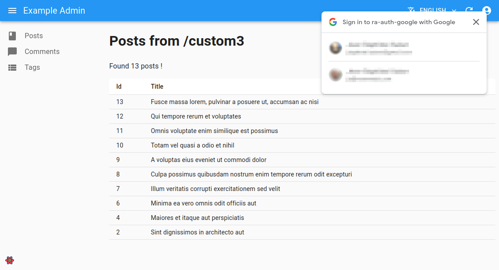

# ra-auth-google

An auth provider for [react-admin](https://github.com/marmelab/react-admin) that handles authentication using the [Google Identity Services (GIS)](https://developers.google.com/identity/gsi/web/guides/overview?hl=en).

It allows to easily enable users to sign in to your app in using their Google account, either personal, or professional via [Google Workspaces](https://workspace.google.com/).



## Content

[![Documentation]][DocumentationLink] 
[![Source Code]][SourceCodeLink] 

[Documentation]: https://img.shields.io/badge/Documentation-green?style=for-the-badge
[Source Code]: https://img.shields.io/badge/Source_Code-blue?style=for-the-badge

[DocumentationLink]: ./packages/ra-auth-google/Readme.md 'Documentation'
[SourceCodeLink]: https://github.com/marmelab/ra-auth-google/tree/main/packages/ra-auth-google 'Source Code'

This repository contains:

-   The actual `ra-auth-google` package
-   A simple demo app you can run locally to try out `ra-auth-google` with your own Google API Client ID

## Simple Demo

### Prerequesites

This demo requires:

- node >= 16
- yarn

To enable Sign In With Google on your website, you first need to set up your **Google API client ID**.

First, if necessary, [configure the OAuth consent screen](https://developers.google.com/workspace/guides/configure-oauth-consent?hl=en) for your project. If your project is still in Test mode, feel free to add some **test users**.

Then, follow this [setup guide](https://developers.google.com/identity/gsi/web/guides/get-google-api-clientid?hl=en) to get your Google API client ID.

When prompted for the **Authorized JavaScript origins**, please add the following values:

- `http://localhost:8080`
- `http://localhost`

### Initial setup

First, clone this project.

```sh
git clone https://github.com/marmelab/ra-auth-google.git
cd ra-auth-google
```

You need to configure the demo app with your **Google API client ID**. Run the following command to initialize the environment variable file:

```sh
make prepare-env
```

In it, fill in the client ID:

```sh
# In packages/demo-react-admin/.env
VITE_GOOGLE_CLIENT_ID="my-application-client-id.apps.googleusercontent.com"
```

You are all set to run the demo app.

### Running The Demo App

Install the dependencies and start the Demo App with the following command:

```sh
make install start
```

### Using the Simple Demo

Now that all is configured and running, you can browse to http://localhost:8080/ to access the React Admin App.

You should be redirected to the login page, which will display a **Sign In With Google** button.

Alternatively, you can browse to http://localhost:8080/#/custom3 (while logged out) to see the **One Tap** button.

Feel free to play around with this demo, along with the GIS library [config](https://developers.google.com/identity/gsi/web/reference/js-reference?hl=en#IdConfiguration), to better understand its internals.

## License

This repository and the code it contains are licensed under the MIT License and sponsored by [marmelab](https://marmelab.com).
